# 🧵 Tailer Shop - Tailor Shop Management System

[](https://kit.svelte.dev/)
[](https://www.typescriptlang.org/)
[](https://www.mongodb.com/atlas)
[](https://tailwindcss.com/)
[](https://jwt.io/)

A **full-stack web application** designed for local tailor shops in Cambodia to digitally manage customer records, track orders, and streamline daily operations — replacing traditional paper-based systems.

🔗 **Live Demo**: [tailer-shop.vercel.app](https://tailer-shop.vercel.app)  
📦 **Repository**: [github.com/Dulkh91/tailer-shop](https://github.com/Dulkh91/tailer-shop)

---

## 📋 Table of Contents

- [Features](#-features)
- [Tech Stack](#-tech-stack)
- [Why This Project?](#-why-this-project)
- [Technical Challenges & Solutions](#-technical-challenges--solutions)
- [Installation & Setup](#-installation--setup)
- [Environment Variables](#-environment-variables)
- [Future Improvements](#-future-improvements)
- [Screenshots](#-screenshots)
- [Author](#-author)

---

## ✨ Features

### 🔐 Authentication
- Secure login system with **JWT** (7-day expiration)
- Password hashing using **bcryptjs**
- Protected routes and API endpoints

### 📊 Customer Management
- **Create** new customer records with shirt/pant measurements
- **Read** all customers in a sortable/filterable table
- **Update** existing customer information
- **Delete** records with confirmation

### 🔍 Advanced Search & Filter
- Real-time search by **name** or **phone number**
- **Column sorting** – click on table headers to sort
- **Date filtering** – filter records by month/year with toggle button

### 📄 Detailed Order View
- Expandable/collapsible sections for shirt and pant details
- Automatic calculation of completed parts
- Separate edit/delete options for each record

### 🎨 UI/UX
- Responsive design with **TailwindCSS**
- **Dark mode** support via **DaisyUI**
- Loading progress bar with **bprogress**
- Clean, intuitive interface for non-tech-savvy users

---

## 🛠 Tech Stack

| Category | Technologies |
|----------|--------------|
| **Frontend** | SvelteKit 5, TypeScript, TailwindCSS, DaisyUI |
| **Backend** | SvelteKit API routes (full-stack) |
| **Database** | MongoDB Atlas (cloud NoSQL) |
| **Authentication** | JWT, bcryptjs |
| **Deployment** | Vercel |
| **Utilities** | bprogress (loading bar) |

---

## 💡 Why This Project?

> *"Many local tailors in Cambodia still use notebooks to track customer orders — leading to lost records, miscalculations, and inefficiency."*

I built **Tailer Shop** to solve this real-world problem. This project demonstrates:

- **Full-stack development** ability (frontend + backend + database)
- **Real-world problem solving** – not just a todo app
- **Clean architecture** with separation of concerns
- **Authentication & security** best practices
- **Production deployment** on Vercel with MongoDB Atlas

---

## 🧠 Technical Challenges & Solutions

### Challenge 1: Dynamic Filtering System
**Problem**: Needed to filter by both text (name/phone) and date (month/year) simultaneously.  
**Solution**: Implemented a composable filter state using Svelte stores that combines multiple filter conditions before querying MongoDB.

### Challenge 2: Nested Measurement Data
**Problem**: Each customer has variable numbers of measurements for shirts and pants.  
**Solution**: Designed a flexible MongoDB schema with nested arrays and implemented expandable UI sections that dynamically render measurement counts.

### Challenge 3: Authentication State Management
**Problem**: Protecting both client-side routes and server API endpoints.  
**Solution**: Used SvelteKit's `handle` hook to verify JWT on every request, with redirect logic for unauthenticated users.

---

## 🚀 Installation & Setup

### Prerequisites
- Node.js (v18 or higher)
- MongoDB Atlas account (free tier works)
- npm or yarn

### Steps

1. **Clone the repository**
```bash
git clone https://github.com/Dulkh91/tailer-shop.git
cd tailer-shop
```

2. **Install dependencies**
```bash
npm install
```
3. **Set up environment variables (see below)**
.env
```bash
# MongoDB
MONGODB_URI = mongodb+srv://<username>:<password>@<cluster>.mongodb.net
DB_NAME = tailor_shop
COLLECTION_NAME = customers
COLLECTION_AUTH_NAME = users

# JWT Authentication
JWT_SECRET = your_super_secret_key_here
JWT_EXPIRES_IN = 7d
```
4. **Run development server**
```bash
npm run dev
```
Open http://localhost:5173
4. **Build for production**
```bash
npm run build
npm run preview
```
## 🔮 Future Improvements
- **PDF Export** – Generate printable receipts/invoices for customers

- **Dashboard Analytics** – Monthly revenue charts and popular items

- **Multi-shop Support** – Allow different shops to have separate accounts

- **Mobile App** – Progressive Web App (PWA) for offline access

- **SMS Notifications** – Auto-remind customers when orders are ready

- **Image Upload** – Attach photos of finished products to customer records

## 📸 Screenshots
|Login| Page	Customer List|	Order Details|


**Login Page**
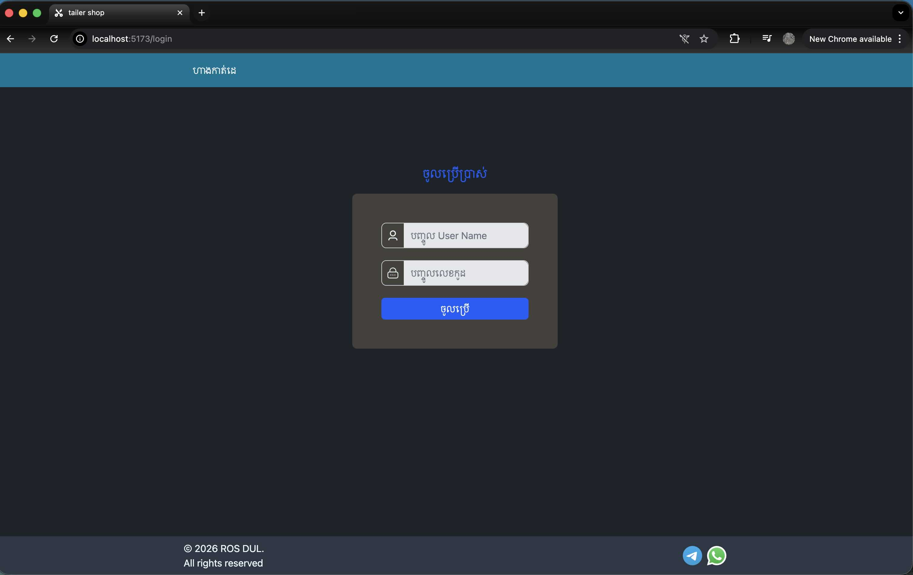
**Add Customer**
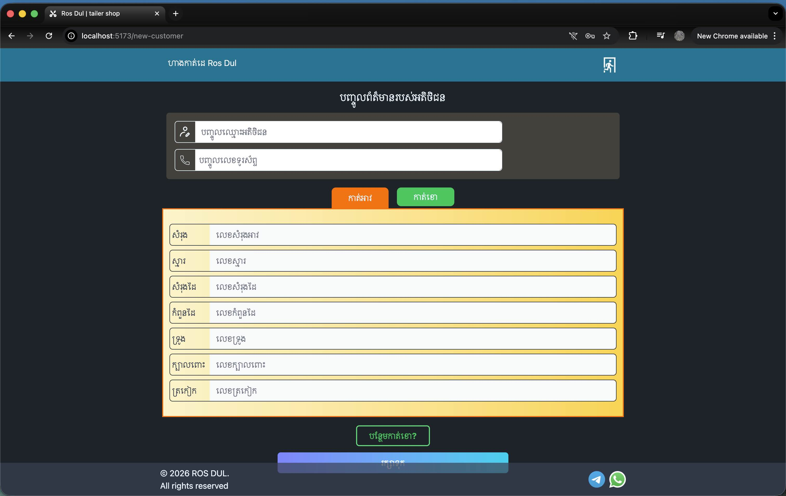
**Customer List**
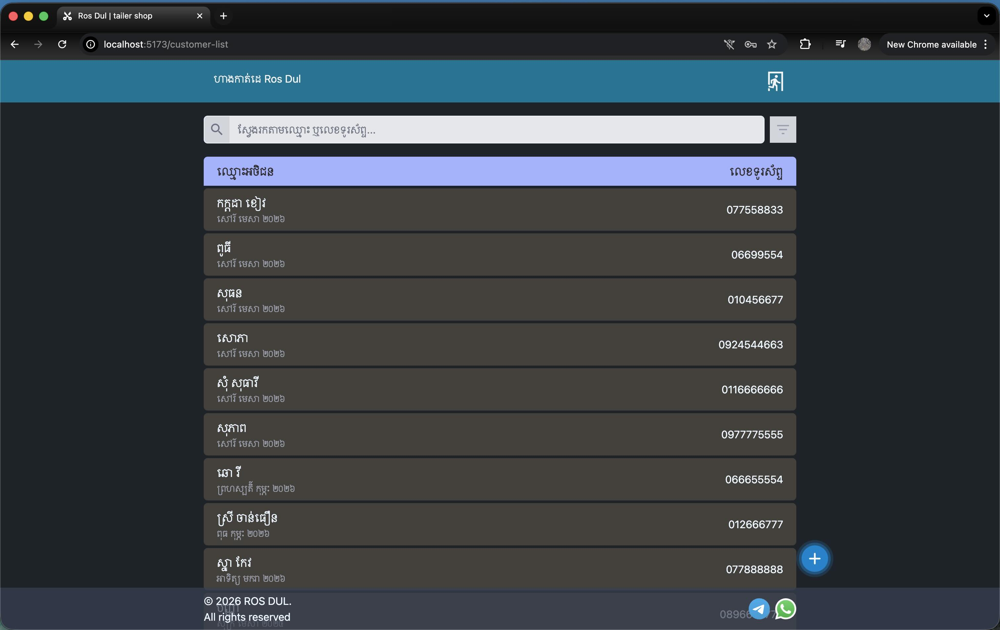
**Searching**
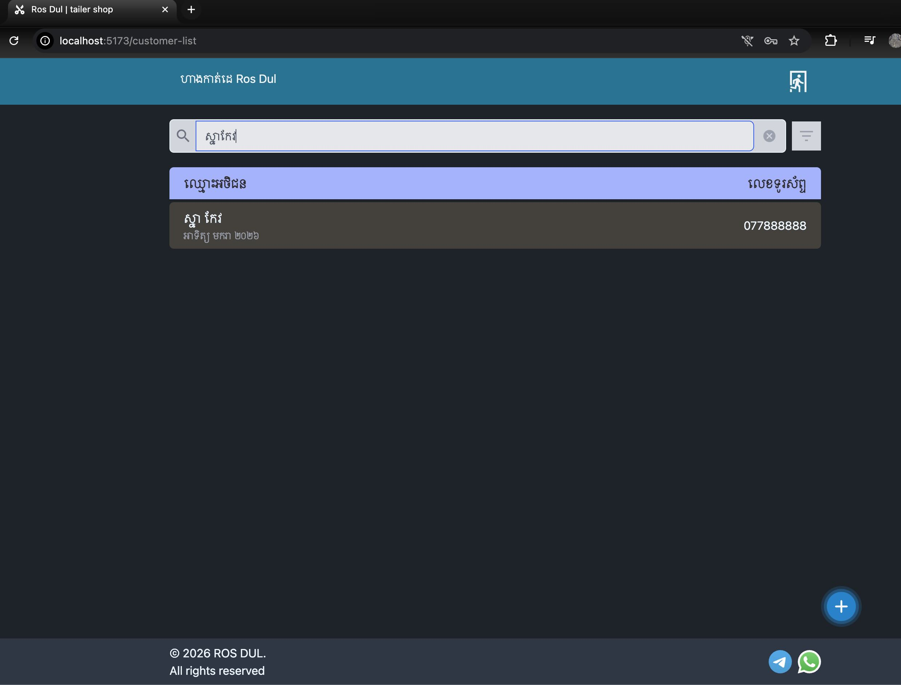
**filter**
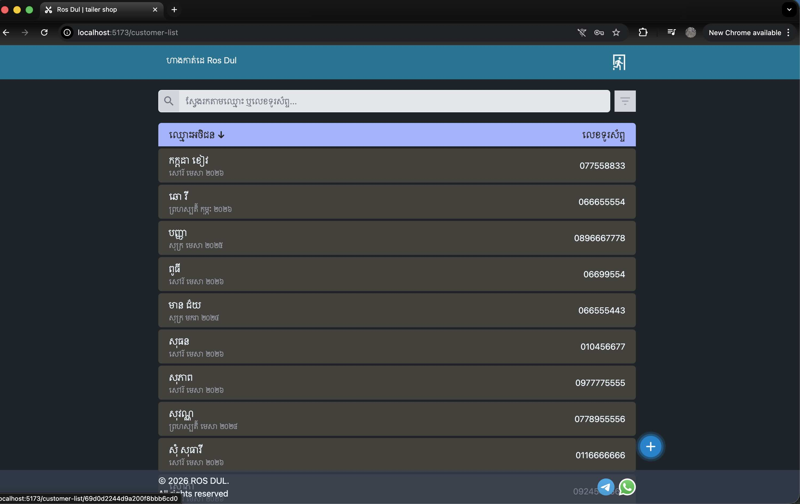
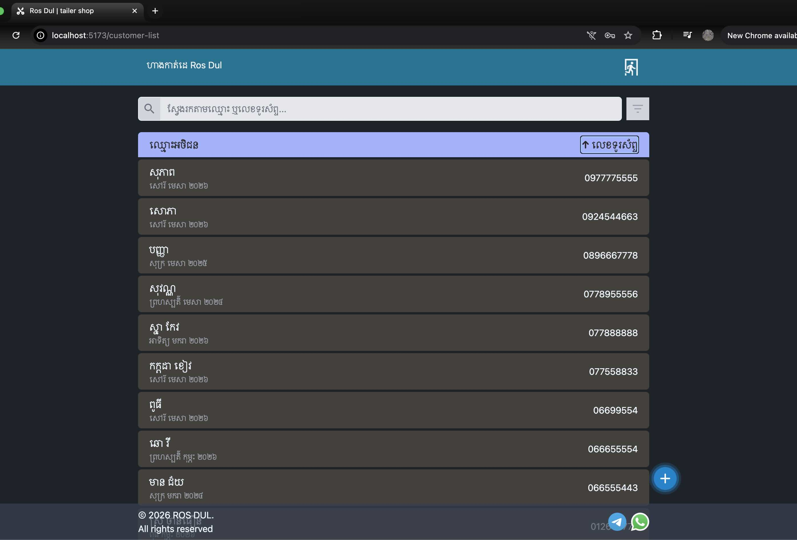
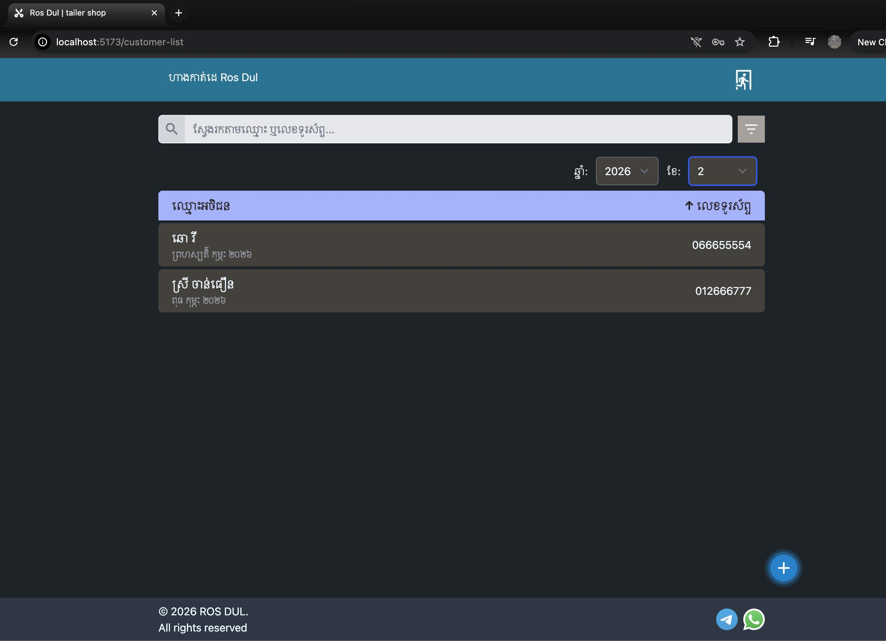
**Customer Detail**
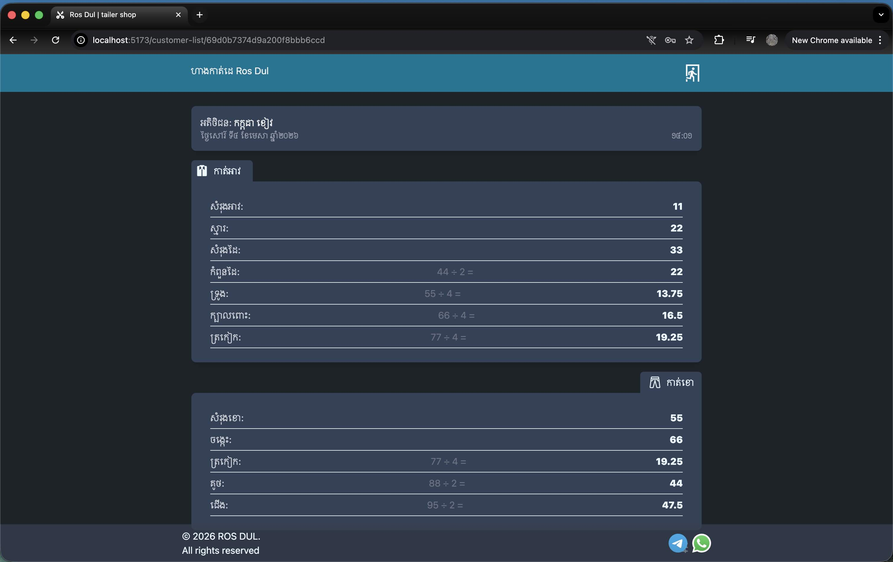 
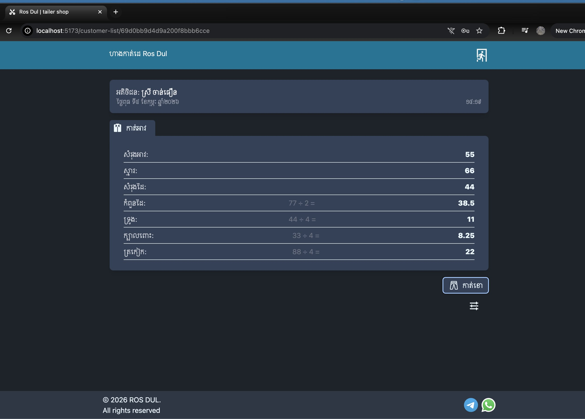 
**Changing**
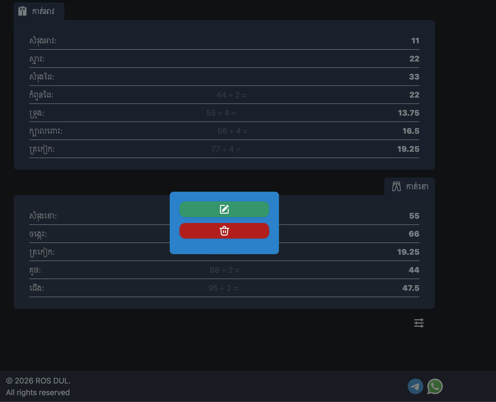 
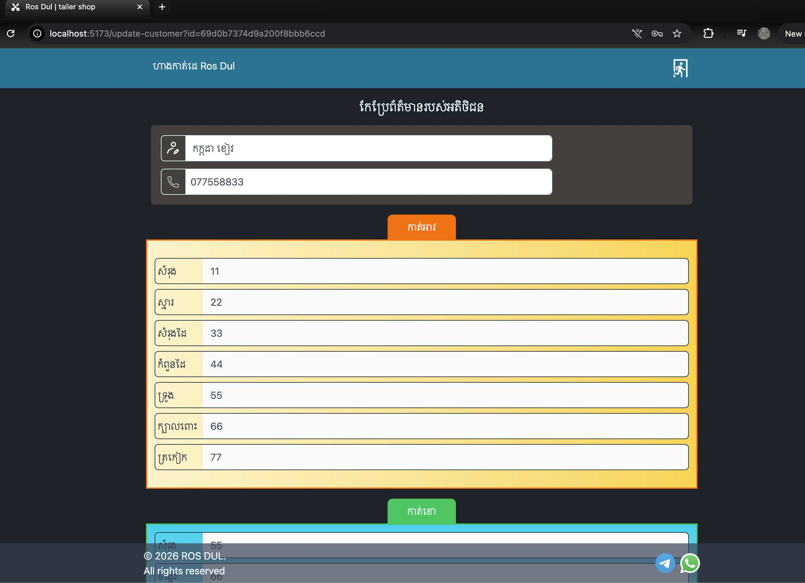 
